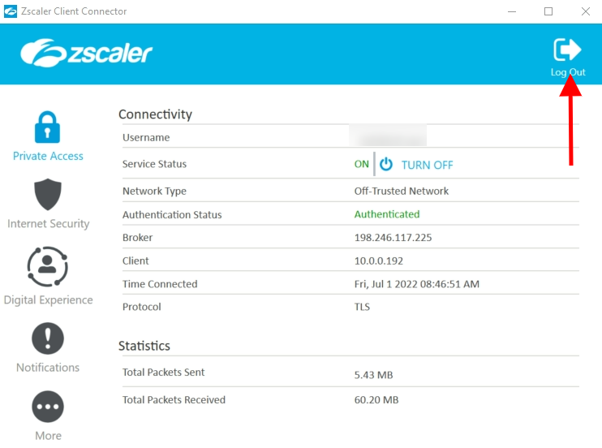

# National Center for Health Statistics (NCHS) - CDC GRASP
This is the code repository for the NCHS web application for visualizing, charting, and mapping data, created by the CDC's GRASP team.

## Developer Documentation
A detailed guide to working within the project.

### Important Links
* [Azure DevOps: NCHS](https://dev.azure.com/GRASP-ATSDR/NCHS_Data_Viz)
* [NCHS Git Repo](https://dev.azure.com/GRASP-ATSDR/_git/NCHS_Data_Viz)

### Cloning the Repo
---

Guidance on where to clone your repo directory :

`C:\Users\your-gov-id\Whatever-you-want-to-call-your-source-root` ... or wherever you want to locate your source directory locally
  -----------------------------------------------------------

In a Terminal-Bash window (Git Bash), perform the following commands to clone into a directory:
```
git clone https://GRASP-ATSDR@dev.azure.com/GRASP-ATSDR/NCHS_Data_Viz/_git/NCHS_Data_Viz
```
***This should clone it into a new directory within whatever directory you initiate the Bash window from.

### ***Installs***
---

Steps:
1. logoff ZSCALER

 
<!--  -->
2. Run `npm install` <b style="color:#ffa500;">Note:</b> this can also be done via VScode see below in VScode way 


### VScode way 
<details>
<summary>Click to expand</summary>


</details>

### ⚠ Ignore the warnings and vulnerabilities after successful install
### Issues with install ?
<details>
<summary>Try these steps (click to expand)</summary>

- Delete the node modules folder and the package-lock.json file

- **logoff ZSCALER**

- `npm install` again


</details>

### Running project locally
---
**⚠Make sure you are logged back on in ZSCALER**
- `npm run watch ` from the bash terminal


After this command it open a browser on https://localhost/nchs. Browser will not refresh when changes are saved, manual refresh required. 

### Creating a branch for development   
----
From within CDT tracker path is from left sidebar:
Repos > Branches 

When working on code, it is advisable to create a new feature branch off of the most current `develop` branch of the repo from the [ **NCHS Web-App**](https://dev.azure.com/GRASP-ATSDR/_git/NCHS_Data_Viz) (It is advised that you create branches from the From your Azure Dev Ops ticket. From your ticket click the ellipses from the top right. In the modal window that opens enter the branch path e.g. feature | bugfix | techdebt path in the required name field.  feature/[Ticket_Number]-description-of-ticket.

**Fields**:

**name**: feature/**#####**_description-of-ticket.

**based on**: develop 

**Work items to link**: use drop down to select your ticket number

See img below:
**NOTE**: Image if from Covid Data Tracker web application, not NCHS, but the NCHS methodology is the same.


 ### Creating Dev URL
 ---
 From your cmd line in git bash run `npm run dev` on a Development branch code. 
This populates the build folder the files needed for the url 

You need access to the GRASP server '\\witv-grsp-2\wwwroot\' if you do not have a folder here reach out to Lincoln Bollschweiler rlv1@cdc.gov or Lance Broeker zyx8@cdc.gov

**2 things here** your local NCHS | App folder
local machine: C:\Users\gov-id\app-name\dist (wherever you saved the the repo)
remote server: witv-grsp-2\wwwroot\
after running `npm run dev`


Copy files over to the server folder `\\witv-grsp-2\wwwroot\CoronavirusInteractive\gov-id` your folder by gov ID
### ⚠**Note** There is a script for this that was written by Bollschweiler, Lincoln (rlv1@cdc.gov)  to automate this process.
You can get a copy of the script (which contains use instructions) at the following link:
**https://cdc-my.sharepoint.com/:u:/g/personal/rlv1_cdc_gov/EXLCi9soLglNmoozLEwWtVQB-xQqWv03aEh0dIRKTcQ00A?e=LF55XQ**

|

 
 This copy process (above) creates your dev url that you can view and share with the QA team, example below:
 Your Dev URL e.g. : https://grasp_internal_test.cdc.gov/NCHS/**your-gov-id**/**folder-name**

 In Azure Dev Ops, drag your ticket to the QA lane, open it, notify @[NCHS_Data_Viz]\QA team your ticket is ready for review.
 Click the link icon and paste in your Dev Url.

### Submitting Code to the Repo for Pull Request Review
In Git Bash
Compile - npm run dev
Stage your file changes - git add .
Commit changes with a comment - git commit -m "Your comment". If it is the first commit, add branch name followed by a brief message.
Push to the repo - git push

Create the Pull Request
In Azure Dev Ops, go to Repos > Pull requests. If your ticket is not already listed as a suggestion for Pull Request, use search feature by ticket number.
1. Create Pull Request
2. Change Your Ticket into main to: Your ticket into develop
3. Add title if not auto-populated with the branch name
4. Add brief description, if none.
5. Create Pull Request (near bottom)


## ⚠**Note**: You will be giving status updates daliy in standup meetings there project member changes can be addressed or reach to Microsoft Teams.  

### Opening PR   
---

Once approved by QA and status in **PRMB** (PR Merge Build) commit your changes and make sure it is caught up with the 'develop' branch and has no merge conlficts.
Pull in the most recent `develop` code and merge it into your feature branch, handling any merge conflicts, and then push your code to the code repository. Open a Pull Request to merge your feature into the `develop` branch Reviewers are added by default. In the description, you may give a description of feature or bugfix that was implemented, and provide DEV URL for the reviewers to test the changes. Upon approval, it will be merged into `develop`.

From Covid Data Tracker > Pull requests > New Pull Request.
Make sure you are merging into develop.


### ESLint and Prettier   
---
The scripts to run ESLint are `npm run lint` and `npm run lint:fix`. The former checks for errors (including Prettier formatting errors) and the latter checks and automatically fixes the errors which it can.

To have VS Code automatically format on save using Prettier, follow the instructions [here](https://github.com/prettier/prettier-vscode#format-on-save) or use the settings editor:


The [Prettier CLI](https://prettier.io/docs/en/cli.html) can be used to check or format a file or files. If you don't have Prettier installed globally, use `npx`. For example, `npx prettier --check .` will check if all files are formatted, and `npx prettier --write .` will format all files.

### Updating the Global Footer   
---
The global footer code in in the server side includes e.g. `<!--#include file="TemplatePackage/includes/footer-cdc.html" -->` in  "CoronaView_prototype.html". Navigate to dev server "\\witv-grsp-2\wwwroot\CoronavirusInteractive\001_DEV_HHS" navigate to the folder the needs changes and make them there. It was previoulsy done within the local dev enviroment dist\TemplatePackage and changes could be seen by runing `http-server`

|           |                      enviorment        |                          server path                                                       |
| --------- | --------------------   |      ---------                                  | 
|see changes in develop              |  001_DEV_HHS  |      `\\witv-grsp-2\wwwroot\CoronavirusInteractive\001_DEV_HHS`                            |
| To see changes in 002_PROD     | 002_PROD_HHS  |       `\\witv-grsp-2\wwwroot\CoronavirusInteractive\002_PROD_HHS\TemplatePackage\includes` | 


### Future improvements to this guide
As the project comes into clearer focus, we hope to add more detail about the code itself, including descriptions of common utilities and common components, as well as best practices when creating new visualizations and how best to format it to fit within the larger context of the application. 


### 508 Compliance - developer guide
---

####  508 Compliance software's and tools used for testing:
 - Keyboard ONLY
 - NVDA or JAWS screen Reader 
 - DNS (Dragon Naturally Speaking)
 - AXE DevTools (browser extension)

### Tables

#### <span style="color:#6d4385"> Purpose</span>

Tables should be created using the following 508 structure so that screen readers, read the appropriate data/text out to the user. 

>NOTE: At the moment, majority of pages with tables are not implemented as mentioned below (we will be working on refactoring the code to match the below structure). However, we can create new tables using the following code structure.

#### <span style="color:#6d4385"> 508 Check/Testing </span> 
- NVDA screen readers *(for developers - recommended but this is an optional step)*
- JAWS *(used for final testing by QA)* 
- ⚠ AXE DevTools ***(HIGHLY recommended for developers to run this browser extension. Especially, if you are not running NVDA - screen readers)***
- Ability to navigate/interact with application using only a keyboard *(by developers and QA)*

<details>
<summary><span style="color: #d76221; font-weight: bold ">TABLE Checklist (click to expand)</span></summary>

#### <span style="color:#6d4385"> Checklist </span>

- Table have a `<caption></caption>` tag, name should be the same has the parent accordion that the table is contained in ***(see Image 1 - Table Caption below)***.
- Column headers are created using an `<th>` tag with a `scope="col"` attribute and has a `tabindex="0"`
- When creating rows with data in the `<tbody>` tag, start with a `<tr>` tag, the first column of the row will be a `<th>` and other columns with data in this row will be created using `<td>` ***(see Image 2 - Columns below)***
- For the first column, `<th>` tag in the row add the following attributes: `scope="row"`, `tabindex="0"`, `aria-label="[column name] + [cell data text]"`
- For the second column, in the row `<td>` tag add the following attributes: `tabindex="0"`, `aria-label="[this rows <th> value] + [this <td> column header name (value)] + [the data value for this cell]"`
- Repeat the same structure for all columns ***(see Image 2 below)***
- Ability to navigate cells and column headers using ONLY a keyboard: `TAB`, arrow (`up`, `down` and at times `left`, `right`), `SPACE`, and at times `ENTER` (test completed by developer's and QA)
- Sortable column headers are sorting accordingly when hitting the `SPACE` or `ENTER` key (this is for keyboard accessibility)
- For cells that have a value or text of **"N/A"**, `aria-label` should change the text (n/a) to **"Not Available"** ***(see Image 3 - NA Value below )***


##### Image 1 - Table Caption :


##### Image 2 - Columns :


##### Image 3 - NA values :


#### <span style="color:#6d4385"> Resources</span> 

[Section508.gov - Tables](https://www.section508.gov/content/guide-accessible-web-design-development/#tables)

[w3.org - Tables](https://www.w3.org/WAI/tutorials/tables/one-header/)

---
</details>

### Dropdown (options)

#### <span style="color:#6d4385">Purpose</span>

Dropdown should be created using the following 508 structure. The code to generate this is already available using the genDropdown.js.

>⚠ NOTE: At the moment, we have multiple dropdown structures depending on the page. Dropdowns creating using `<div>`, or `<select>` tags. For the most part the genDropdown.js file creates the dropdown selection using a `<div>`, which is what we want to use. County View is using a `<select>`. Below is a checklist to lookout when using either of the options.
<br /> <br />Developer's just need to check that the code generated from the genDropdown.js has the following.

#### <span style="color:#6d4385"> 508 Check/Testing</span> 

- NVDA screen readers *(for developers - recommended but this is an optional step)*
- ⚠ AXE DevTools ***(HIGHLY recommended for developers to run this browser extension. Especially, if you are not running NVDA - screen readers)***
- Ability to navigate using ONLY a keyboard: `tab`, arrow (`up`, `down` and at times `left`, `right`), `space`, and at times `enter` (test completed by developer's and QA)
- JAWS *(used for final testing by QA)*
- DNS *(Dragon Naturally Speaking used by QA)*

<details>
<summary><span style="color: #d76221; font-weight: bold ">DROPDOWN Checklist (click to expand)</span></summary>

#### <span style="color:#6d4385"> Checklist</span> 

#### <span style="text-decoration: underline;"> Select tag option checklist (manually created) </span>

- `<select>` tag has an `ID` and `data ref` attribute
- A `<label>` tag that has a `for` attribute that **is equal** to the ID of the `<select>` tag. The `for` attribute will connect the `<label>` and `<select>` tags
- `<option>` tags have a `value` attribute


#### <span style="text-decoration: underline;"> DIV tag option checklist (generated by genDropdown.js) </span>

- Parent `<div>` that has the following attributes: `ID`, `tabindex="0"`, `role=listbox`, `aria-labelledby` that **is equal** to the `<label>` ID
- `<label>` tag that has the following attributes: `ID`,  `for` attribute that **is equal** to the **ID** of the parent `<div>` and an `aria-label` with a dynamic value that changes text per user selection
-  `<a>` should be dynamic as well that changes per user selection *(this is used for Dragon Naturally Speaking)*
- Options for the dropdown are created using a `<div>`. The following attributes should be generated: `role` that **equals** to *option*, `arial-label` that **equals the value**, and a `tabindex="0"`


---

</details>

### Radio buttons and Checkboxes

#### <span style="color:#6d4385">Purpose</span>

Radio buttons and Checkboxes should be created so that:
- Ability to navigate using ONLY a keyboard: `tab`, arrow (`up`, `down` and at times `left`, `right`), `space`, and at times `enter` (test completed by developer's and QA)
- Screen-readers can read out the proper radio buttons or checkboxes label to the user and also the group name/label, if it is part of a group
- And when a user is using Dragon Naturally Reading and executing the commands **"Click radio button"** or **"Click [radio label name]"** the software will execute that action/option


>NOTE: None of the individual elements on a form need a `tabindex="0"`, because form elements are already recognized by screen readers and accessible by keyboard `tab` key
#### <span style="color:#6d4385"> 508 Check/Testing</span> 

- NVDA screen readers *(for developers - recommended but this is an optional step)*
- ⚠ AXE DevTools ***(HIGHLY recommended for developers to run this browser extension. Especially, if you are not running NVDA - screen readers)***
- Ability to navigate using ONLY a keyboard: `tab`, arrow (`up`, `down`, `left`, `right`), `space`, and at times `enter` (test completed by developer's and QA)
- JAWS *(used for final testing by QA)*
- DNS *(Dragon Naturally Speaking used by QA)*

<details>
<summary><span style="color: #d76221; font-weight: bold ">RADIO BUTTONS and CHECKBOXES Checklist (click to expand)</span></summary>

##### <span style="text-decoration: underline;">Structure</span>


```html
<form>
  <fieldset> <!-- Reference 1-->
    <legend></legend> <!--Reference 2-->
    <div> <!--Reference 3-->
      <input />  <!--Reference 4-->
      <label></label> <!--Reference 5-->
    </div>
    <div>
      <input />
      <label></label>
    </div>
  </fieldset>
</form>
```


#### <span style="color:#6d4385"> Checklist </span>

- <span style="text-decoration: underline;"> Reference 1</span> -  has a `<fieldset>` : This allows screen reader to know that anything in the *fieldset* container is a group.
- <span style="text-decoration: underline;"> Reference 2</span> - has a group `<label>` : This gives a name to the group, which will be read out by screen readers to the user informing that it's a group.
- <span style="text-decoration: underline;"> Reference 3</span> - has a `<div>` : this is optional, it is just used to group the label and radio button and checkbox
- <span style="text-decoration: underline;"> Reference 4</span> - has a `<input>` : Should have an **ID** which will be connected to its label. And it allows the user to use the commands **"Click radio button"** or **"Click [radio label name]"** and it will also make the radio or checkboxes label clickable (no need to add a special js event to the label to make it executable)
- <span style="text-decoration: underline;"> Reference 5</span> - has a `<label>` : should have a `for` attribute that is **equals** to the `ID` of the `<input>`.

#### <span style="color:#6d4385"> Resources</span> 

[Section 508 - Radio buttons and Checkboxes](https://www.section508.gov/content/guide-accessible-web-design-development/#forms)

---

</details>

### Links and, Anchor links and Buttons

#### <span style="color:#6d4385">Purpose</span>

Links should be generated so that screen readers, reads the appropriate data/text out to the user and so that users can use the commands **Click button/link** or **Click [name of button or link]**

>NOTE: None of these elements need a `tabindex="0"`, because `<button>` and `<a>` are already recognized by screen readers and accessible by keyboard `tab` key and also Dragon naturally speaking.

#### <span style="color:#6d4385"> 508 Check/Testing</span> 

- NVDA screen readers *(for developers - recommended but this is an optional step)*
- ⚠ AXE DevTools ***(HIGHLY recommended for developers to run this browser extension. Especially, if you are not running NVDA - screen readers)***
- Ability to navigate using ONLY a keyboard: `tab`, arrow (`up`, `down`, `left`, `right`), `space`, and at times `enter` (test completed by developer's and QA)
- JAWS *(used for final testing by QA)*
- DNS *(Dragon Naturally Speaking used by QA)*

<details>
<summary><span style="color: #d76221; font-weight: bold ">LINKS and ANCHOR links Checklist (click to expand)</span></summary>

#### <span style="color:#6d4385"> Checklist</span> 

#### <span style="text-decoration: underline;"> Links </span>

- Ability to navigate using ONLY a keyboard: `tab`, arrow (`up`, `down`, `left`, `right`), `space`, and at times `enter` (test completed by developer's and QA)
- Does not have a `tabindex="0"`

#### <span style="text-decoration: underline;"> Buttons </span>

- Ability to navigate using ONLY a keyboard: `tab`, arrow (`up`, `down`, `left`, `right`), `space`, and at times `enter` (test completed by developer's and QA)
- Does not have a `tabindex="0"`

#### <span style="text-decoration: underline;"> Anchor links </span>

- Ability to navigate using ONLY a keyboard: `tab`, arrow (`up`, `down`, `left`, `right`), `space`, and at times `enter` (test completed by developer's and QA)
- If it does not have a `href` you will need to make sure that the event has a key event as well and also a `tabindex="0"`
- > Note: it is preferred to create anchor **"links"** using the `<button>` tag instead of a `<a>`, because at some point any `<a>` without *href* will not be recognized by browsers

---

</details>

### Text

#### <span style="color:#6d4385">Purpose</span>

Unlike, header tags (example: `<h1>`), form elements, links and button. Text within, a `<p>`, `<div>`, or `<span>` **are not** read out to the user by screen readers. You will need to add a `tabindex="0"` to these elements if the text contains important information.

#### <span style="color:#6d4385"> 508 Check/Testing</span> 
- NVDA screen readers *(for developers - recommended but this is an optional step)*
- ⚠ AXE DevTools ***(HIGHLY recommended for developers to run this browser extension. Especially, if you are not running NVDA - screen readers)***
- JAWS *(used for final testing by QA)*

<details>
<summary><span style="color: #d76221; font-weight: bold ">TEXT Checklist (click to expand)</span></summary>

#### <span style="color:#6d4385"> Checklist and best approach</span> 

- If you have multiple `<p>` in a row. It would be best to contain all of the `<p>` in a parent `<div>` and then add a `tabindex="0"`
- Test this by tabbing through the page (use the `tab` key) and see if that container has a border as shown below


---
</details>

### Images

#### <span style="color:#6d4385">Purpose</span>

To make accessible by screen reader (JAWS and NVDA)

#### <span style="color:#6d4385"> 508 Check/Testing</span> 
- ⚠ AXE DevTools ***(HIGHLY recommended for developers to run this browser extension. Especially, if you are not running NVDA - screen readers)***

<details>
<summary><span style="color: #d76221; font-weight: bold ">Image Checklist (click to expand)</span></summary>

#### <span style="color:#6d4385"> Checklist and best approach</span> 

- All `<image>` tag should have an `alt` attribute
- If an image is an icoon `<i>` and/or it is clickable (as an js event), you will need to add a `tabindex="0"`. And you will also need to make sure that the javascript has a `keypress` or `keydown` that would execute the event when the user either **clicks**, hits `ENTER` and/or `SPACE`  

---
</details>


### Other Resources 

[Axe DevTools - guide (download or bookmark)](https://cdc-my.sharepoint.com/:w:/g/personal/ynm3_cdc_gov/EWt-soOOv8ZKm9H8Nzc5XT4Bx54A-tJh6o_BI-0qQ4JbRw?e=W9KhCI)

[Section 508 - web developer guideline (downloadable or bookmark - similar to the README information)](https://cdc-my.sharepoint.com/:w:/r/personal/ynm3_cdc_gov/Documents/+My_Documents/GRASP/Covid%20Data%20Tracker/Section508/Documents/Web%20Developer%20-%20508%20Compliance%20Guidelines_03082023.docx?d=w2fa52bf3389847149116f2f38cbc9460&csf=1&web=1&e=T9HV36)


>  ##### *508 compliance information updated: 03/14/2023*
